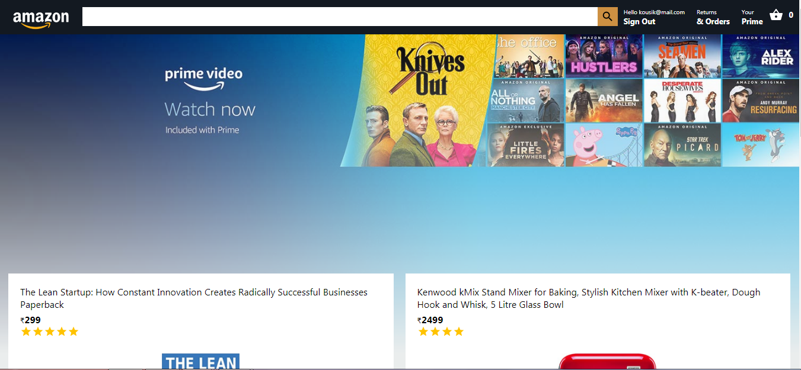

<p align="center">
   
</p>

# Amazon Clone

[](https://github.com/imkousik9)

Shopping app like amazon made with Reactjs & Firebase

# Application Links

Frontend Code -> [https://github.com/imkousik9/amazon-clone](https://github.com/imkousik9/amazon-clone)
<br>
Deployed URL -> [https://clone-b687e.web.app](https://clone-b687e.web.app)
<br>

**Run the site locally**

### Step 1: Clone The Repo

Fork the repository. then clone the repo locally by doing -

```bash
git clone https://github.com/imkousik9/amazon-clone.git
```

### Step 2: Install Dependencies

cd into the directory

```bash
cd amazon-clone
```

install all the dependencies

```bash
yarn
# or
npm install
```

### Step 3: Start Development Server

Then start the development Server

```bash
yarn dev
# or
npm run dev
```

After running the development server the site should be running on https://localhost:3000

# Tech Stack

<b>Frontend</b>: Reactjs
<br>
<b>Backend</b>: Firebase, Firebase functions
<br>
<b>Styling</b>: CSS, Material-UI
<br>
<b>Payment Getaway</b>: Stripe
<br>
<b>Deployment</b>: Firebase
